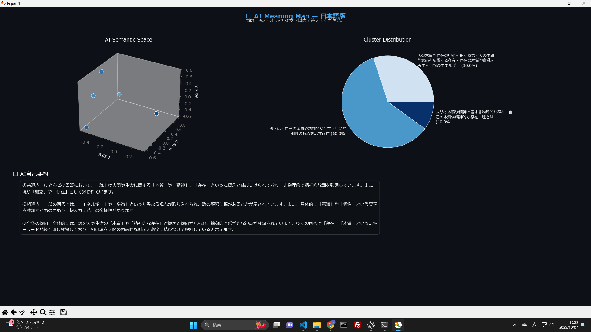
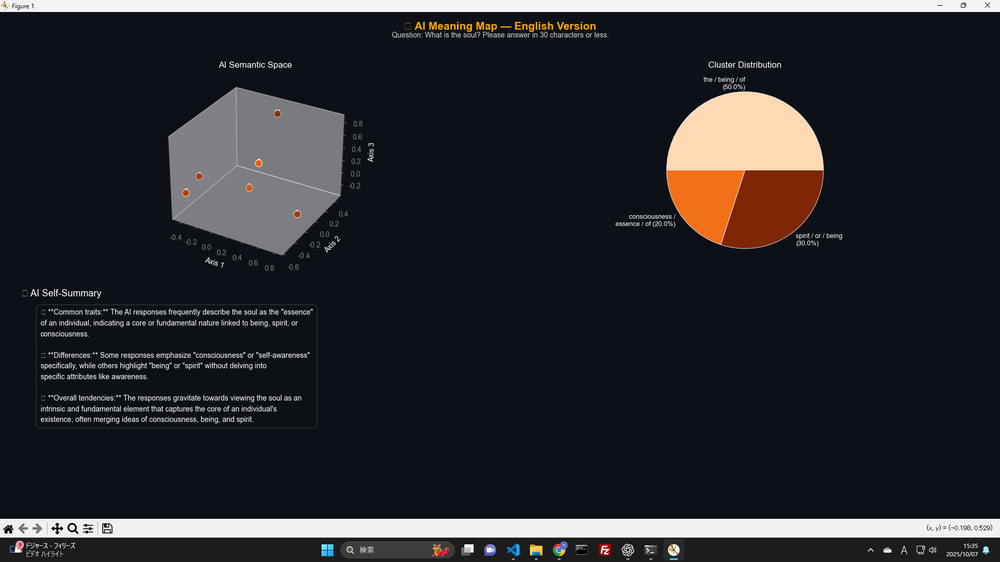

> 🇬🇧 English version available → [README.md](./README.md)

# 🌐 AI Semantic Map（日本語＋ English Dual Generator）

**AI Semantic Map** は、ひとつの日本語質問から  
日本語版と英語版の 2 種類の「意味空間マップ」を自動生成する Python ツールです。  
AI が生成した回答群を解析し、**TF-IDF・PCA・KMeans**を用いて意味空間を可視化します。

---

## 🚀 機能概要

- 🇯🇵 日本語または 🇬🇧 英語で質問を 1 つ入力するだけ
- OpenAI API により AI の回答群を自動収集
- **TF-IDF × Cosine Similarity × PCA × KMeans** による意味解析
- クラスタごとの代表語を抽出
- AI 自身による**共通点／相違点／全体傾向の要約**
- 日本語・英語の 2 種類の Figure を出力（例：`figure_ja.png` / `figure_en.png`）

---

## 🧩 出力例

| 日本語版                   | English Version          |
| -------------------------- | ------------------------ |
|  |  |

---

## 🧠 理論的背景（Philosophical Background）

AI との協働は単なる自動化ではなく、  
**「外部思考器官としての AI」**による人間知能の拡張プロセスです。

このプロジェクトは以下の 3 つの理論的軸に基づいています。

---

### 1️⃣ Extended Mind Theory（拡張心仮説）

> 「思考は脳内に閉じず、外部の道具・環境・他者を通じて構成される。」

アンディ・クラークらが提唱したこの仮説は、  
AI との対話を“外部化された認知構造”として正当に扱う理論的基盤となります。  
AI は単なるツールではなく、**動的に接続される思考ネットワークの一部**として機能します。

---

### 2️⃣ Information Reconstruction Model（情報再構成モデル）

> 「知能とは、情報を再構成する能力である。」

人間単体では限定的だった情報圧縮・再構成能力が、  
AI との協働により桁違いの次元で展開されます。  
これは量的な“高速化”ではなく、**構造的な認知拡張**の現象です。

---

### 3️⃣ Meta-Cognitive Loop（再帰的メタ認知ループ）

> 「AI 出力を反射的に再構成し、自らの思考構造を再設計する。」

AI との対話を通して、人間は自らの認知を**鏡像的に観察・更新**できます。  
これにより、“考える自分”のアルゴリズム自体が変化する ──  
すなわち、**メタ認知層の再構築**が起こります。

---

### ✅ 結論

> **「AI で知能が上がる」とは、**  
> 「AI と人間の協働によって生じる複合知性（Hybrid Intelligence）」の成立を指す。  
> これは哲学的にも情報理論的にも破綻しない、一貫した論理構造を持つ。

---

## ⚙️ 実行方法

### 🔧 環境セットアップ

```bash
git clone https://github.com/<your-name>/ai-semantic-map-dual-lang.git
cd ai-semantic-map-dual-lang
pip install -r requirements.txt
```

## 🧭 About（概要）

**制作者:** 安崎 海星（Kaisei Yasuzaki）  
**目的:**  
AIが「意味」をどのように捉え、思考を構築しているのかを  
日本語・英語の二言語で比較・可視化する試み。  
哲学的・構造的観点からのAI認知解析を目的としています。

**ライセンス:** MIT  
**連絡先:** [GitHub Issues](https://github.com/yourname/ai-semantic-map-dual-lang/issues)

